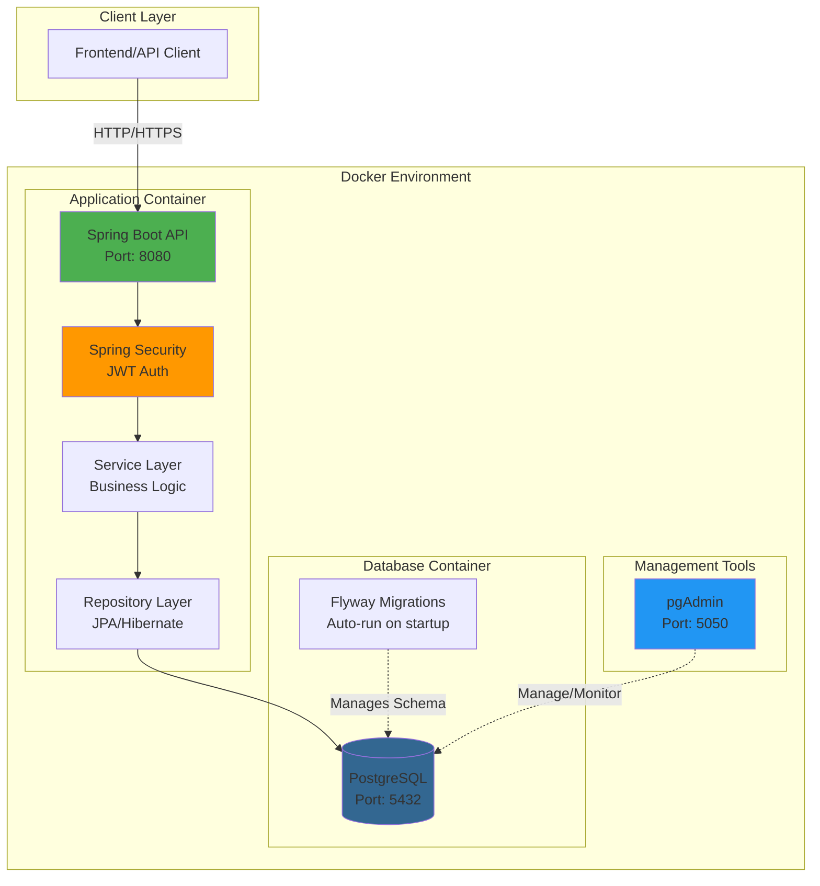
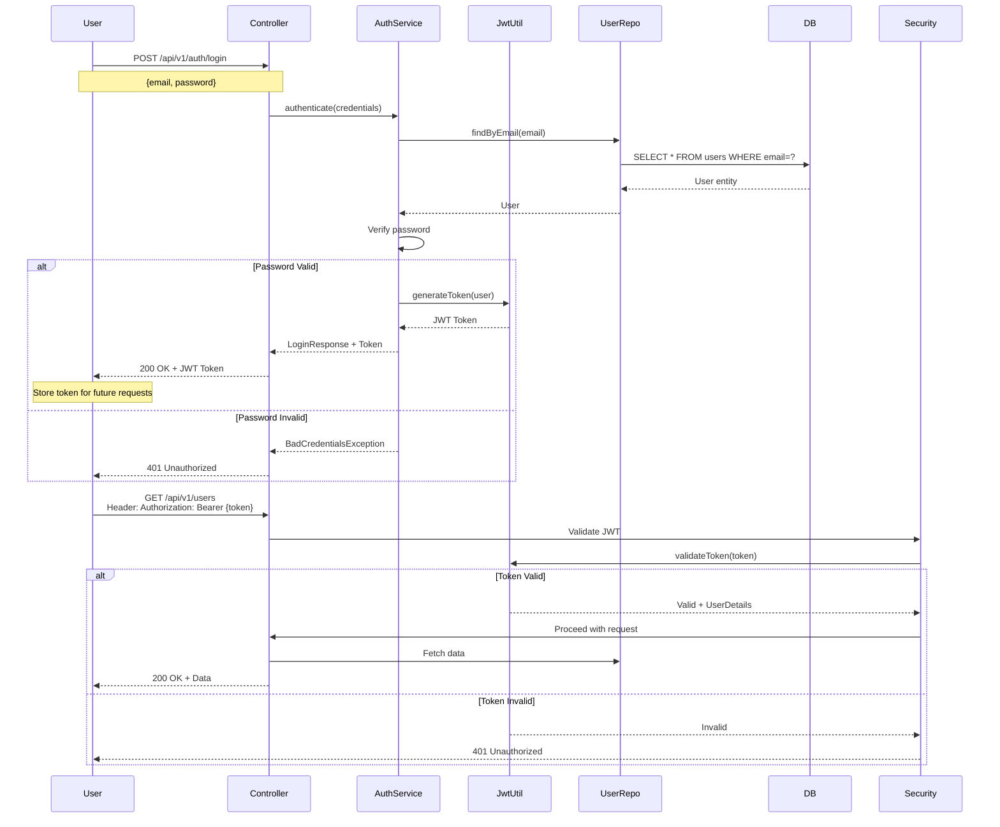
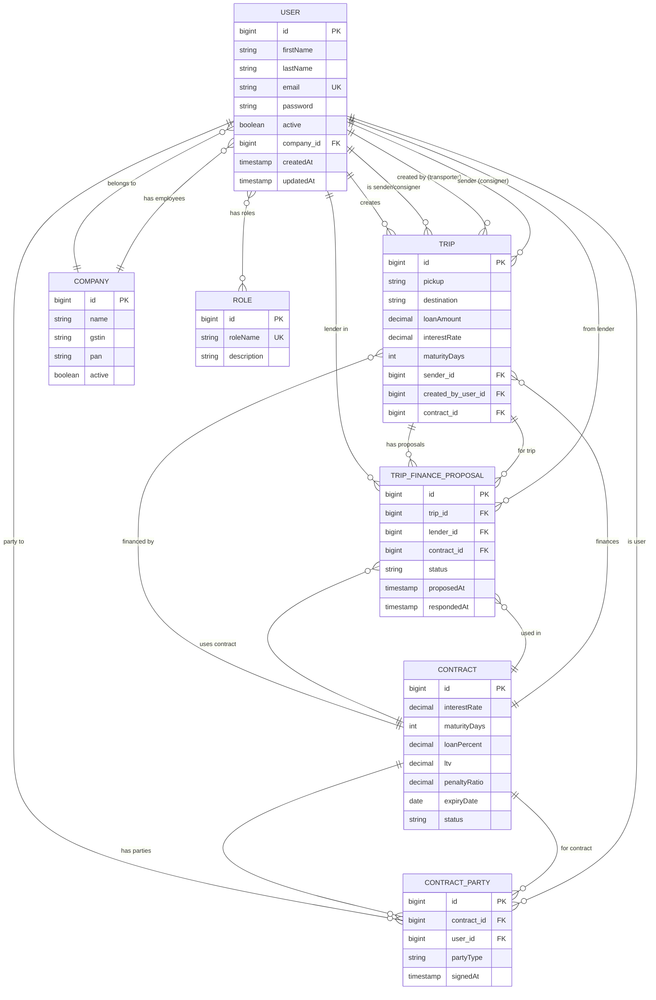
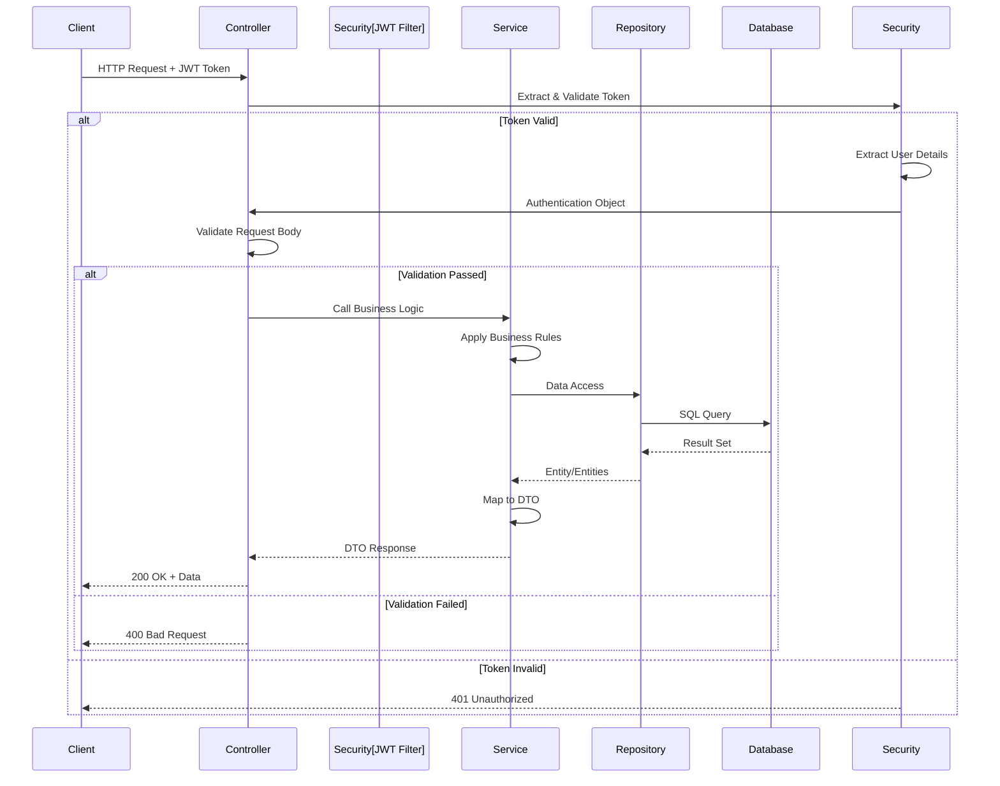
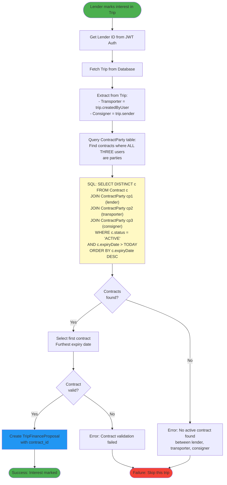
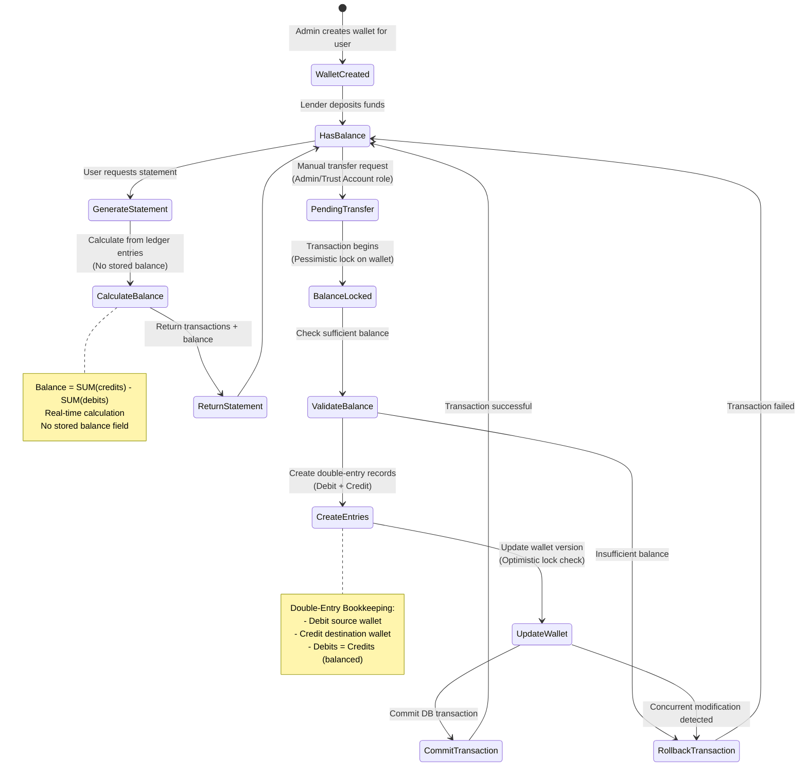
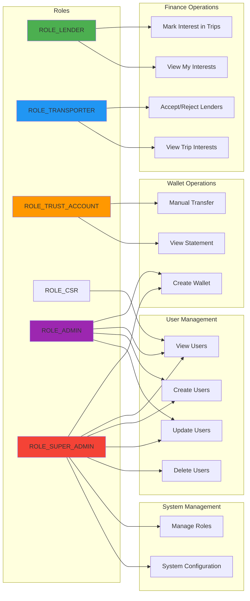
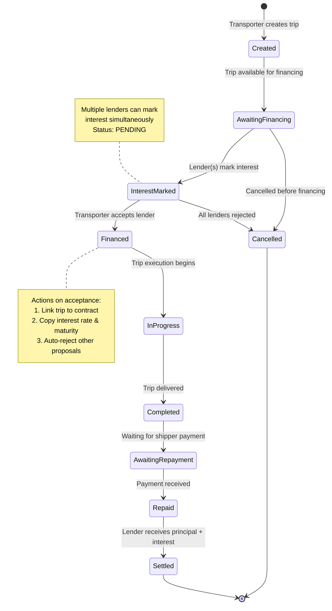
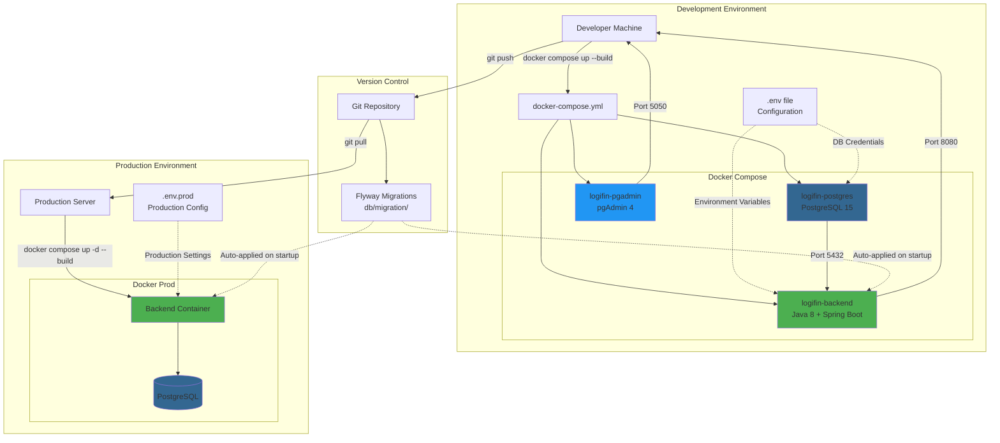

# Logifin Project - Visual Diagrams

> **Note**: These diagrams use Mermaid syntax and render automatically on GitHub, VS Code (with Mermaid extension), and many markdown viewers.

> **Looking for User Interface Flows?** Check out [USER_JOURNEY_DIAGRAMS.md](USER_JOURNEY_DIAGRAMS.md) for detailed user journey diagrams with forms, buttons, and screen layouts!

---

## Table of Contents
1. [System Architecture](#1-system-architecture)
2. [Authentication Flow](#2-authentication-flow)
3. [Trip Financing Flow](#3-trip-financing-flow-main-business-logic)
4. [Database Entity Relationships](#4-database-entity-relationships)
5. [API Request Flow](#5-api-request-flow)
6. [Contract Discovery Process](#6-contract-discovery-process)
7. [Wallet Transaction Flow](#7-wallet-transaction-flow)

---

## 1. System Architecture



---

## 2. Authentication Flow



---

## 3. Trip Financing Flow (Main Business Logic)

```mermaid
graph TB
    Start([Start]) --> TransporterCreatesTrip[Transporter Creates Trip<br/>with Pickup, Destination, Amount]

    TransporterCreatesTrip --> TripInDB[(Trip saved in DB<br/>Status: Available)]

    TripInDB --> LenderBrowses[Lender browses available trips]

    LenderBrowses --> LenderSelects[Lender selects MULTIPLE trips<br/>e.g., Trip 101, 102, 103]

    LenderSelects --> BatchAPI[API: POST /lenders/finance-interests<br/>Body: tripIds: 101, 102, 103]

    BatchAPI --> ProcessEachTrip{Process each trip<br/>individually}

    ProcessEachTrip --> FindContract[Auto-find Contract between:<br/>1. Lender ID from Auth<br/>2. Trip's Transporter<br/>3. Trip's Consigner]

    FindContract --> ContractExists{Contract<br/>exists?}

    ContractExists -->|Yes| ContractValid{Contract<br/>ACTIVE &<br/>not expired?}
    ContractExists -->|No| MarkFailed1[Mark trip as FAILED<br/>Error: No contract found]

    ContractValid -->|Yes| CheckDuplicate{Already<br/>marked interest?}
    ContractValid -->|No| MarkFailed2[Mark trip as FAILED<br/>Error: Contract expired]

    CheckDuplicate -->|No| CreateProposal[Create TripFinanceProposal<br/>Status: PENDING]
    CheckDuplicate -->|Yes| MarkFailed3[Mark trip as FAILED<br/>Error: Already interested]

    CreateProposal --> MarkSuccess[Mark trip as SUCCESS<br/>Save proposal ID]

    MarkFailed1 --> NextTrip{More trips?}
    MarkFailed2 --> NextTrip
    MarkFailed3 --> NextTrip
    MarkSuccess --> NextTrip

    NextTrip -->|Yes| ProcessEachTrip
    NextTrip -->|No| ReturnBatchResponse[Return Batch Response<br/>successCount, failureCount<br/>per-trip results]

    ReturnBatchResponse --> TransporterViews[Transporter views trip<br/>sees interested lenders]

    TransporterViews --> TransporterSeesDetails[Sees for each lender:<br/>- Name, Company<br/>- Contract terms<br/>- Interest rate, Maturity days]

    TransporterSeesDetails --> TransporterChooses{Transporter<br/>chooses lender}

    TransporterChooses -->|Accept| AcceptLender[API: POST /{id}/accept]
    TransporterChooses -->|Reject| RejectLender[API: POST /{id}/reject]

    AcceptLender --> UpdateProposal[Update proposal to ACCEPTED]
    UpdateProposal --> LinkTripToContract[Link Trip to Contract<br/>Copy interest rate, maturity days]
    LinkTripToContract --> AutoReject[Auto-REJECT all other<br/>PENDING proposals for this trip]
    AutoReject --> TripFinanced[Trip is now FINANCED<br/>Ready for execution]

    RejectLender --> RejectSingle[Update single proposal to REJECTED<br/>Others remain PENDING]

    TripFinanced --> End([End])
    RejectSingle --> End

    style Start fill:#4CAF50
    style End fill:#4CAF50
    style CreateProposal fill:#2196F3
    style TripFinanced fill:#FF9800
    style MarkFailed1 fill:#f44336
    style MarkFailed2 fill:#f44336
    style MarkFailed3 fill:#f44336
```

---

## 4. Database Entity Relationships



---

## 5. API Request Flow



---

## 6. Contract Discovery Process



---

## 7. Wallet Transaction Flow



---

## 8. User Role Access Matrix



---

## 9. Trip Lifecycle States



---

## 10. Deployment Architecture



---

## How to View These Diagrams

### Option 1: GitHub (Automatic)
- Push this file to GitHub
- Diagrams render automatically in the web interface

### Option 2: VS Code
- Install "Markdown Preview Mermaid Support" extension
- Open this file and click "Preview" button
- Diagrams render in preview pane

### Option 3: Online Mermaid Editors
- Copy diagram code to: https://mermaid.live/
- Edit and export as PNG/SVG if needed

### Option 4: IntelliJ IDEA / WebStorm
- Built-in Mermaid support in markdown preview
- Just open and view this file

---

## Diagram Syntax Reference

All diagrams use Mermaid syntax:
- `graph TB` = Top to Bottom flowchart
- `sequenceDiagram` = Sequence/timing diagram
- `erDiagram` = Entity Relationship diagram
- `stateDiagram-v2` = State machine diagram
- `flowchart TD` = Modern flowchart syntax

---

**Last Updated**: 2025-12-19
**Version**: 1.0
**Related Files**: PROJECT_CONTEXT.md, README.md
